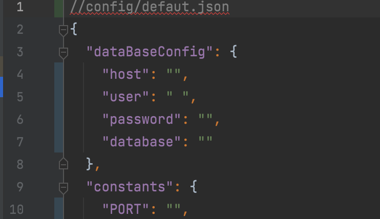
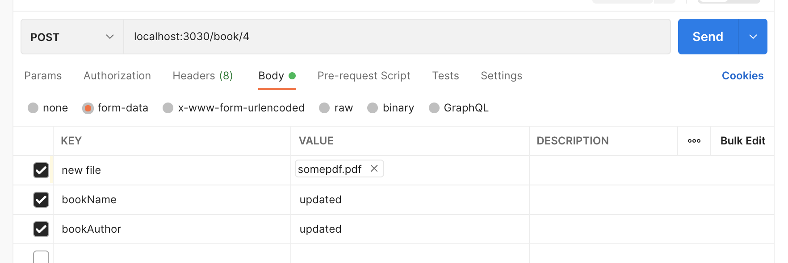

#CRUD

    For creating, reading, updating and deleting books information to database mySQL.

##Installation

    Dowload this packege from git repository and do configuration which are described bellow

1. Create your database mySQL using terminal using database management system MySql
2. Open terminal and go to the folder this project
3. Write next command damp db - is in project folder.   
```mysql -u <username> -p <name data base> <dump.sql> ```  
4. Next you need to fill in database configurations and PORT   

5. Take next name for you field in data-form  
``` bookName, bookAuthor```  
6. Also you need to have field for downloading file.

##Usage  

    Create requsts for testing  



    


