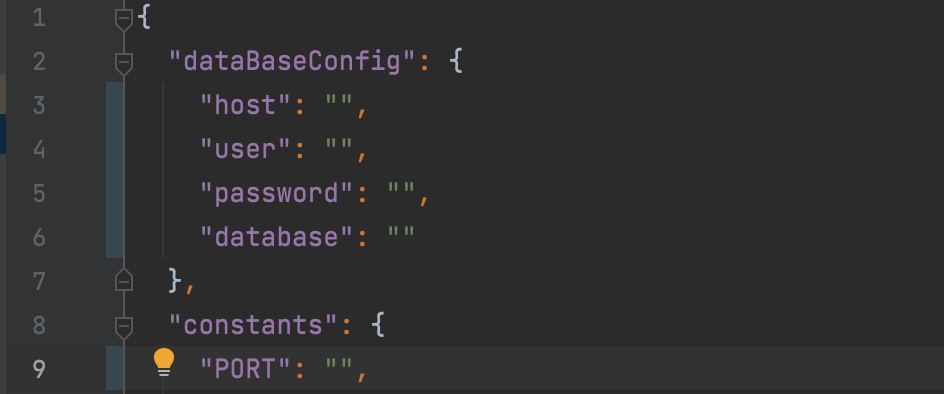
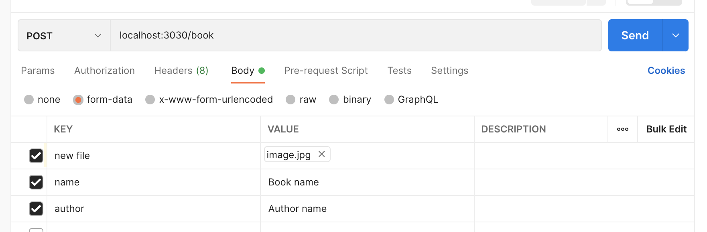
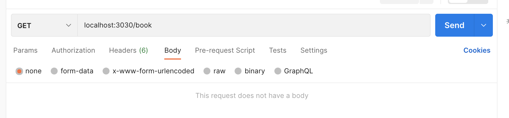
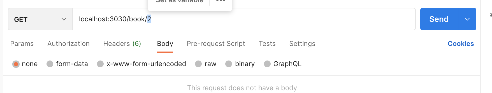
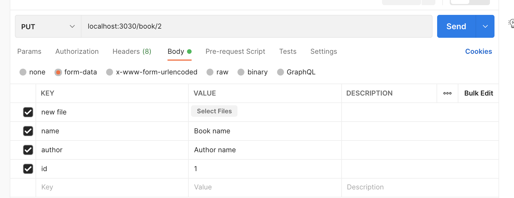
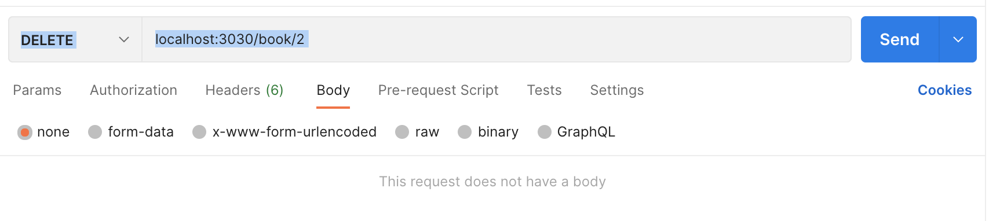
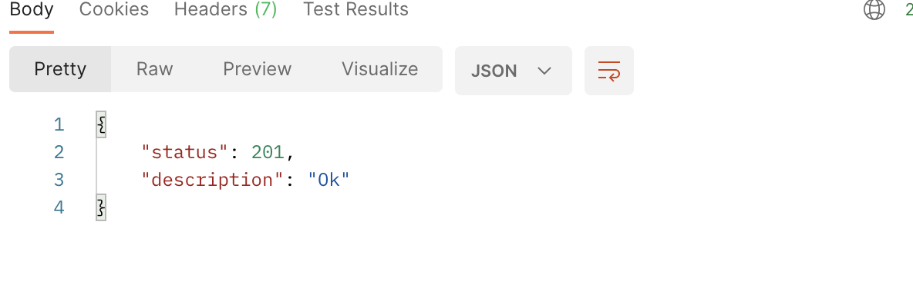

# CRUD

    This code you can use for creating, reading, updating and getting information about added books to database mySQL.

## Installation

     Bellow you can find out descriding procces installation and list of tools which are necessary for futher work.  
___

* First things first you need to have such tools witch have to be installed on your computer:

  * ___Database management system MySql___. You can read how to install this system following [this link](https://dev.mysql.com/doc/mysql-installation-excerpt/5.7/en/). Link for [downloading](https://dev.mysql.com/downloads/mysql/).  
    I also recommend to watcth [video](https://www.youtube.com/watch?v=n1zT1OZcgnw) for understanding how to configure Mysql.
  * ___Any text redactor, where you can open project.___ I can propose you [WebStorm](https://www.jetbrains.com/ru-ru/webstorm/). You can try using it during 30-days free. 
  * [___NodeJS___](https://nodejs.org/en/). [Video instraction](https://www.youtube.com/watch?v=JINE4D0Syqw). NPM (package manager) have been added to this installation.  
  * [Git](https://git-scm.com/book/en/v2) - for downloading the project from remote repository. 
  * [POSTMAN](https://www.postman.com/downloads/) for testing requests.
___

* If you have already had all tools, let's go to installation CRUD on your computer:  
  * Open terminal on your computer and follow to folder with your project, for instance: ```cd /Users/macbook/Project```
  * Next you should initialize GIT in your project folder, execute the command ```git init``` in the terminal.
  * To download CRUD, execute this command ```git clone https://github.com/sergeyYushchenko1987/crud_v_1``` and app will set in your folder.  
  * Install all dependencies which are neсessary for work from package.json ```npm instal```.
  
___

# Settings


    You should do some settings before can use CRUD. Follow this instruction for the right work of code.
___
* Upload database to MySql:
  * Launch you MySql ```mysql -u <username> -p <password>```. Create new database ```CREATE DATABASE <nameDataBase>;```
  * Follow folder where you save crud ```cd /Users/macbook/Project/crud_v_1``` and execute the command ```mysql -u <username> -p <nameDataBase> < <dump.sql>```  
* Next you need to fill in configuration file ```default.json``` which you can find in folder ```config``` in project. PORT - server's port

* In your form-data insert options ```name``` for fields: ```name, author, any filename```   
* Also you need to have field for downloading file. You can select anything ```name``` for this field.
___

# Launching

    Execute next command from your terminal:
* node app   
___
___You can go to testing after server will be launched.___
___


# Usage  

    You can use this package creating http requsts using different metods for this (POST - add object, GET - get object, PUT - update, DELETE - delate) for every operation. You will receive responses in JSON format. 
____

### ___REQUESTES___

<a href="">_POST_</a>  
___
It's used to add elements to database. Select method(POST), input: host, url```(/book)```, value in fields name, author; select file on your computer for uploading.

___

<a href="">_GET_</a>

It's used to get elements from database. Select method(GET) and url(/book)



You can get certain record.  Select method(GET) and url(/book) and add record's id


___

<a href="">_PUT_</a>

It's used to update elements from database. Select method(PUT), url(/book), add field ```<id>``` to body

___

<a href="">_DETETE_</a>

It's used to delete elements from database. Select method(PUT), url(/book/id), add field ```<id>``` to url


___

### __RESPONSES__

    After every request you will receive resonse in the format JSON.
    On "GET" requests you will receive list of books. On PUT, DELETE, POST requests server will send response with status and description, for example:




    


